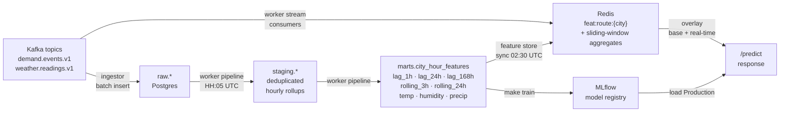
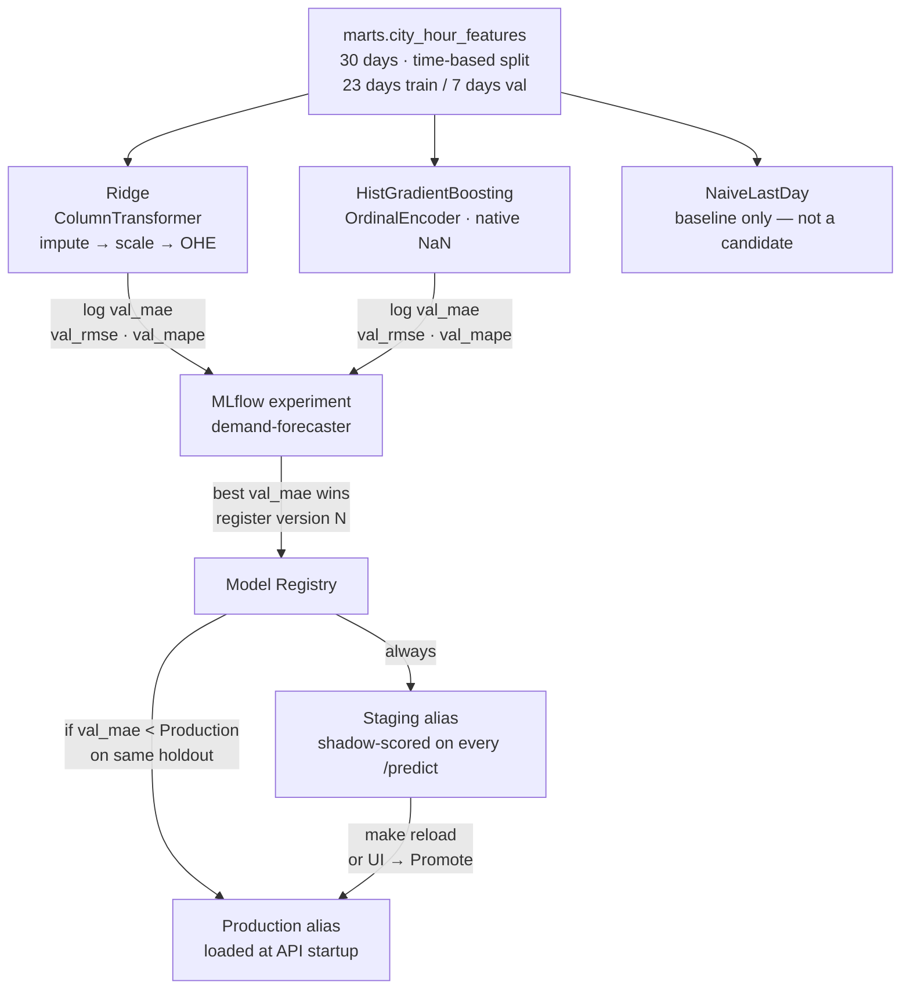

# Weather-Driven Demand Forecasting Platform

A full-stack, production-grade forecasting system that ingests simulated demand
events and weather signals in real time, trains scikit-learn models tracked in
MLflow, and serves multi-step predictions through a FastAPI backend with a React
dashboard — all running locally in Docker Compose with a single `make` command.

---

## Table of Contents

- [What This Demonstrates](#what-this-demonstrates)
- [Architecture Overview](#architecture-overview)
- [Data Pipeline](#data-pipeline)
- [ML Lifecycle](#ml-lifecycle)
- [Quick Start](#quick-start)
- [Profiles Reference](#profiles-reference)
- [Ports at a Glance](#ports-at-a-glance)
- [Make Targets](#make-targets)
- [Testing](#testing)
- [Configuration](#configuration)
- [Observability](#observability)
- [Chaos Engineering](#chaos-engineering)
- [Key Design Decisions](#key-design-decisions)
- [Project Structure](#project-structure)

---

## What This Demonstrates

| Concern | Implementation |
|---|---|
| **Event streaming** | Redpanda (Kafka-compatible), three consumer groups, dead-letter queue |
| **Dual-store ingestion** | Single writer → Postgres (OLTP) + MinIO Parquet lake (OLAP) simultaneously |
| **Batch ETL** | Scheduled worker: raw → staging (dedup + reject log) → marts (lag features, rolling aggregates) |
| **Real-time feature cache** | Redis hash per city (`feat:route:{city}`), sliding-window demand aggregates updated per message |
| **ML model management** | MLflow experiment tracking, model registry, Staging/Production promotion, shadow scoring |
| **Live prediction serving** | FastAPI with Redis overlay, asyncio thread pool for sklearn inference, WebSocket broadcast |
| **Feature drift detection** | Evidently per-feature drift scores, auto-retrain with 6-hour cooldown |
| **Observability** | Prometheus + Grafana dashboards + Alertmanager with four alert rules |
| **Fault injection** | Mock weather service with configurable error rate, latency, null fields, schema drift |
| **Containerised testing** | Three-tier suite (unit / integration / e2e) — nothing runs on the host |

---

## Architecture Overview

```
┌─────────────────────────────────────────────────────────────────────────────┐
│  Data Generation                                                            │
│  event-generator ──────────────────────────────────────────────────────┐   │
│  weather-poller ──→ mock-weather (:8001)  ─────────────────────────┐   │   │
└──────────────────────────────────────────────────────────────────────│───│──┘
                                                                       │   │
┌──────────────────────────────────────────────────────────────────────▼───▼──┐
│  Redpanda  (Kafka API · :19092)                                             │
│  demand.events.v1  ╱  weather.readings.v1  ╱  demand.events.dlq            │
└──────────────────────────────┬──────────────────────────────────────────────┘
                               │  consume
       ┌───────────────────────▼───────────────────────────────┐
       │  ingestor                                             │
       │  • validates + batch-inserts → Postgres raw.*         │
       │  • flushes hourly Parquet → MinIO s3://lake/raw/…     │
       └──────────────┬──────────────────────┬─────────────────┘
                      │                      │
          ┌───────────▼──────────┐  ┌────────▼────────────────┐
          │  Postgres (:5432)    │  │  MinIO (:9000)           │
          │  raw / staging /     │  │  lake bucket (Parquet)   │
          │  marts / audit logs  │  │  mlflow bucket (models)  │
          └───────────┬──────────┘  └─────────────────────────┘
                      │  read raw.*
       ┌──────────────▼────────────────────────────────────────┐
       │  worker  (APScheduler)                                │
       │  • pipeline job (HH:05): raw→staging→marts→scaler     │
       │  • feature store sync (02:30): push marts to Redis    │
       │  • stream consumers: sliding-window aggregates        │
       │  • drift check: Evidently scores → Prometheus         │
       │  • auto-retrain: trigger trainer on drift > 0.3       │
       └──────────────┬──────────────────────┬─────────────────┘
                      │ staging + marts       │ HSET feat:route:*
          ┌───────────▼──────────┐  ┌────────▼────────────────┐
          │  Postgres (marts)    │  │  Redis (:6379)           │
          │  city_hour_features  │  │  real-time feature cache │
          └───────────┬──────────┘  └────────┬────────────────┘
                      │ train features        │ feature overlay
       ┌──────────────▼──────────────────┐   │
       │  trainer (one-shot)             │   │
       │  • NaiveLastDay baseline        │   │
       │  • Ridge (ColumnTransformer)    │   │
       │  • HistGradientBoosting         │   │
       │  • best val_mae → MLflow reg.   │   │
       └──────────────┬──────────────────┘   │
                      │ load model            │
       ┌──────────────▼──────────────────────▼─────────────────┐
       │  FastAPI (:8080)                                       │
       │  GET  /health /ready /cities /model/info               │
       │  POST /predict  (multi-step, shadow-score Staging)     │
       │  WS   /ws/live  (broadcast every predict + 60s)        │
       │  POST /admin/reload  (hot-swap models, no restart)     │
       └──────────────────────────┬─────────────────────────────┘
                                  │  REST + WebSocket
                        ┌─────────▼──────────┐
                        │  React UI (:5173)  │
                        │  Live · Model ·    │
                        │  Pipeline · Drift  │
                        └────────────────────┘

   ─── Prometheus (:9090) scrapes api + ingestor + worker + drift + pushgateway
   ─── Grafana (:3001)  — Pipeline Health · Model Performance · Data Quality
   ─── Alertmanager (:9093) — 4 alert rules (lag, drift, latency, staleness)
```

### Services at a glance

| Service | Role | Profile |
|---|---|---|
| **postgres** | System of record — raw events, staging, marts, audit | core |
| **redis** | Real-time feature cache (HSET per city, sliding windows) | core |
| **minio** | Object storage — Parquet lake + MLflow model artifacts | core |
| **mock-weather** | Synthetic weather API with chaos controls | core |
| **api** | FastAPI — predictions, model management, metrics proxy | core |
| **redpanda** | Kafka-compatible message broker (3 topics) | stream |
| **event-generator** | Produces synthetic demand events at configurable sim speed | stream |
| **weather-poller** | Polls mock-weather → produces weather readings | stream |
| **ingestor** | Dual-write consumer (Postgres + MinIO Parquet) | stream |
| **worker** | Batch pipeline, feature store sync, drift detection, auto-retrain | stream |
| **trainer** | One-shot Ridge + HGB training, MLflow registration | ml |
| **mlflow** | Experiment tracking and model registry | ml |
| **clickhouse** | Columnar OLAP store for large analytical queries | ml |
| **prometheus** | Metrics collection and alert evaluation | obs |
| **grafana** | Dashboards — Pipeline Health, Model Performance, Data Quality | obs |
| **pushgateway** | Persists trainer metrics between runs | obs |
| **alertmanager** | Alert routing and deduplication | obs |
| **drift** | Evidently feature drift scoring (scheduled) | obs |
| **ui** | React SPA — nginx-served production build | ui |

---

## Data Pipeline



**Three phases run in the `worker` service:**

1. **Staging** (`raw.*` → `staging.*`)
   Deduplicates rows by `event_id`, validates non-null constraints, logs
   rejects to `staging.rejects`, aggregates demand and weather to hourly
   resolution.

2. **Marts** (`staging.*` → `marts.city_hour_features`)
   Joins demand and weather, computes lag features (`demand_lag_1h/24h/168h`),
   rolling aggregates (`demand_roll_3h/24h`), and cyclical time encodings
   (`hour_sin/cos`, `dow_sin/cos`).

3. **Feature store sync** (marts → Redis)
   Pushes the latest mart row per city as a Redis hash; the API uses these
   as the base feature vector before overlaying sliding-window aggregates
   from the always-on stream consumers.

---

## ML Lifecycle



**Key serving details:**

- The API loads both Production and Staging on startup (or `make reload`).
- Every `/predict` call runs Production synchronously and launches a background
  task to shadow-score Staging — the shadow result is logged to
  `marts.prediction_log` and `marts.prediction_features` but never returned
  to the caller.
- Feature drift is computed by the worker's drift job using Evidently. When
  any feature score exceeds `RETRAIN_DRIFT_THRESHOLD` (default 0.3), the
  worker triggers training in a background thread with a 6-hour cooldown
  (`RETRAIN_COOLDOWN_MINUTES=360`) to prevent thrashing.

---

## Quick Start

### Prerequisites

- Docker 25+
- Docker Compose v2.24+
- GNU Make 3.81+

No Python, Node, or other tooling is needed on the host. Everything runs in
containers.

### Minimal start (API only)

```bash
git clone <repo>
cd weather-demand-forecast

make env           # copies .env.example → .env
# Edit .env: set POSTGRES_PASSWORD and REDIS_PASSWORD (anything non-empty)

make up            # starts postgres, redis, minio, api
make ps            # verify all containers are healthy
```

The API is now live at **http://localhost:8080**.

```bash
curl http://localhost:8080/health
# {"status":"ok"}

curl http://localhost:8080/ready
# 503 — no model loaded yet (run make train after the full stack is up)
```

### Full stack (streaming + ML + UI)

```bash
make env
# edit .env passwords

make up-stream     # core + redpanda + producers + ingestor + worker
make ps            # all healthy?

# Let it run for ~2 minutes so the worker pipeline has data to train on.
# Then start the ML profile:
make up-ml         # clickhouse + mlflow

make migrate       # apply all Alembic migrations
make train         # train Ridge + HGB, register to MLflow, promote to Production

make reload        # hot-load the new model into the API (no restart)
curl http://localhost:8080/ready
# {"status":"ok","production_model":"demand-forecaster/1","staging_model":null}

curl -s http://localhost:8080/cities
# ["dubai","london","new_york","sydney","tokyo"]

curl -s -X POST http://localhost:8080/predict \
  -H "Content-Type: application/json" \
  -d '{"city":"london","horizon_hours":24}'
```

### Add observability

```bash
make up-obs        # prometheus + grafana + alertmanager + drift
```

- Grafana:      **http://localhost:3001** (admin / value of `GRAFANA_PASSWORD`)
- Prometheus:   **http://localhost:9090**
- Alertmanager: **http://localhost:9093**

### Add the React dashboard

```bash
make up-ui         # production nginx build
# or
make dev-ui        # Vite HMR dev server (edit src/, browser updates instantly)
```

Dashboard: **http://localhost:5173**

### Everything at once

```bash
make up-all
```

---

## Profiles Reference

Profiles are additive opt-in groups. Use `docker compose --profile <name> up -d`
or the `make up-*` shortcuts.

| Profile | Services | Purpose |
|---|---|---|
| `core` | postgres, redis, minio, minio-init, mock-weather, api | Development baseline + serving |
| `stream` | redpanda, redpanda-console, redpanda-init, event-generator, weather-poller, ingestor, worker | Event streaming + batch pipeline |
| `ml` | clickhouse, mlflow, trainer, bench | Model training and analytics |
| `obs` | prometheus, grafana, pushgateway, alertmanager, webhook-receiver, drift | Monitoring and alerting |
| `ui` | ui | React dashboard (nginx production build) |
| `ui-dev` | ui-dev | React dashboard (Vite HMR, bind-mounted src/) |
| `tools` | alembic, lake, skew-check | Utility containers (migrations, lake CLI) |
| `test` | test-common, test-ingestor | Unit test runner images |

---

## Ports at a Glance

All ports are bound to `127.0.0.1` only.

| Service | Host port | Notes |
|---|---|---|
| **API** | 8080 | FastAPI (internal: 8000) |
| **Mock weather** | 8001 | Fake weather server |
| **React UI** | 5173 | Vite dev or nginx prod |
| **Postgres** | 5432 | `psql -h localhost -U forecast forecast` |
| **Redis** | 6379 | `redis-cli -a $REDIS_PASSWORD` |
| **MinIO S3** | 9000 | AWS SDK endpoint |
| **MinIO console** | 9001 | Browser UI |
| **Redpanda Kafka** | 19092 | Kafka bootstrap server |
| **Redpanda console** | 8082 | Topic / consumer lag UI |
| **MLflow** | 5001 | Experiment tracking UI |
| **ClickHouse HTTP** | 8123 | `/ping`, query endpoint |
| **Prometheus** | 9090 | Query and alert UI |
| **Grafana** | 3001 | Dashboards (admin / `GRAFANA_PASSWORD`) |
| **Pushgateway** | 9091 | One-shot job metrics |
| **Alertmanager** | 9093 | Alert routing UI |

---

## Make Targets

### Stack lifecycle

```bash
make up            # core (postgres, redis, minio, api)
make up-stream     # core + streaming
make up-ml         # core + ml (clickhouse, mlflow)
make up-obs        # core + observability
make up-ui         # core + ui (production build)
make dev-ui        # core + ui-dev (HMR)
make up-all        # everything

make down          # stop all containers, keep volumes
make destroy       # stop all containers AND delete volumes
make reset         # destroy volumes, restart core from scratch
```

### Inspect

```bash
make ps                        # container health overview
make logs                      # tail all logs
make logs-api                  # tail a single service
make shell-db                  # psql inside Postgres
make shell-redis                # redis-cli inside Redis
make verify                    # health checks + mock-weather endpoint assertions
make inspect-features          # dump all feat:route:* hashes from Redis
```

### Database migrations (Alembic)

```bash
make migrate                   # upgrade head (apply all pending)
make migrate-new MSG="add_col" # scaffold a new migration file
make migrate-down              # downgrade one step (REV=base to wipe all)
make migrate-history           # full migration history
make migrate-current           # current applied revision
make migrate-check             # roundtrip test: base → head  ⚠ DESTRUCTIVE
```

### ML

```bash
make train                     # train Ridge + HGB, register to MLflow
make reload                    # hot-swap Production + Staging in the API
make worker-pipeline           # run the batch pipeline once right now
```

### Tools

```bash
make lake CMD="list"                         # list all Parquet files in MinIO
make lake CMD="preview raw/demand_events/…"  # preview a Parquet file via DuckDB
make lake-counts [TABLE=demand_events]       # city event counts for last 3 hours
make check-skew                              # diff serving features vs warehouse
make bench                                   # Postgres vs ClickHouse (10 M rows)
make backfill DATE_START=… DATE_END=…        # replay Parquet lake → raw.*
make replay GROUP=ingestor-demand TS=…       # reset Kafka consumer offset to timestamp
```

### Testing

```bash
make test-unit         # all services, no live infrastructure
make test-integration  # requires: make up
make test-e2e          # requires: make up (postgres + redis + api)
make test              # all three tiers  (requires core stack up)
```

---

## Testing

All tests run inside Docker containers. No test runner, pytest, or Python on the host.

```
Tier 1: Unit         No live services needed.  Postgres-dependent fixtures
                     skip cleanly (connect_timeout=3, OperationalError →
                     pytest.skip).  FastAPI tests use a null lifespan to
                     bypass startup I/O entirely.

Tier 2: Integration  Worker integration tests against live Postgres.
                     Fixtures use real psycopg2 connections; the test schema
                     is rolled back after each test.

Tier 3: E2E          Full path: direct Postgres insert → run_pipeline() →
                     POST /predict via live API.  API unavailability is
                     pytest.fail (not skip) — the full stack is required.
```

```bash
# Tier 1 — no dependencies, runs anywhere
make test-unit
# → 70 libs/common  +  11 ingestor  +  4 trainer  +  29 api  +  81 worker = 195 tests

# Tier 2 — needs postgres + redis
make up && make migrate
make test-integration

# Tier 3 — needs postgres + redis + api
make up && make migrate && make train && make reload
make test-e2e
```

**Unit test coverage includes:**

| Service | What's tested |
|---|---|
| `libs/common` | Kafka producer envelope, weather generator bounds, feature registry |
| `ingestor` | `_Buffered` dataclass, `batch_insert_demand_events`, `batch_insert_weather_readings` column ordering and null handling |
| `api` | `/health`, `/ready` (503 vs 200), `/cities` service guards, `PredictRequest` schema bounds, `_time_feats` sin/cos identity, `_build_rows` shape and lag feature propagation |
| `worker` | Feature store sync Redis mapping, pipeline PIT correctness, stream Redis ops, training-serving skew detection |
| `trainer` | Reproducibility, time-based split, metric stability |

---

## Configuration

Copy `.env.example` to `.env` and set the required values before running
`make up`. Everything else has safe defaults.

### Required

```dotenv
POSTGRES_PASSWORD=<strong-password>
REDIS_PASSWORD=<strong-password>
```

### Stream tuning

```dotenv
GENERATOR_CITIES=london,new_york,tokyo,sydney,dubai  # cities to simulate
GENERATOR_TICK_INTERVAL_S=1.0   # real seconds per tick
GENERATOR_SIM_SPEED=3600.0      # sim seconds per real second (3600 = 1 day/hour)
POLLER_POLL_INTERVAL_S=30.0     # weather poll frequency (real seconds)
```

### ML

```dotenv
TRAINING_LOOKBACK_DAYS=30   # days of mart history to load for training
TRAINER_VAL_DAYS=7          # holdout window (most recent N days)
PUSHGATEWAY_URL=http://pushgateway:9091  # enable metric push from trainer
```

### Drift / auto-retrain

```dotenv
AUTO_RETRAIN_ON_DRIFT=true         # trigger trainer when drift > threshold
RETRAIN_DRIFT_THRESHOLD=0.3        # Evidently score that fires auto-retrain
RETRAIN_COOLDOWN_MINUTES=360       # suppress repeat triggers for 6 h
```

### Observability

```dotenv
GRAFANA_PASSWORD=admin
```

### Chaos (mock-weather)

```dotenv
FAULT_LATENCY_MS=0         # inject response latency
FAULT_ERROR_RATE=0.0       # fraction of requests that return 5xx
FAULT_NULL_FIELD_RATE=0.0  # fraction of fields set to null
FAULT_SCHEMA_DRIFT=false   # rename fields to break downstream parsers
```

---

## Observability

### Dashboards

Three Grafana dashboards are provisioned automatically from
`infra/grafana/dashboards/`:

| Dashboard | Key panels |
|---|---|
| **Pipeline Health** | Kafka consumer lag, ingestor throughput, DLQ count, last pipeline run, mart row count |
| **Model Performance** | Last trained timestamp, Production val_mae/rmse/mape, shadow delta (Production vs Staging) |
| **Data Quality** | Features currently drifting (0 = green, 1+ = orange, 3+ = red), per-feature drift score over time |

### Alert rules

Four rules in `infra/prometheus/alerts.yml`, routed through Alertmanager:

| Alert | Expression | Fires when |
|---|---|---|
| **KafkaConsumerLagHigh** | `redpanda_kafka_consumer_group_lag > 1000` | Any consumer group is 1 000+ messages behind for 5 min |
| **FeatureDriftHigh** | `drift_score > 0.2` | Any feature's Evidently drift score exceeds 0.2 (immediate) |
| **PredictionLatencyHigh** | `histogram_quantile(0.99, …{path="/predict"}…) > 0.5` | /predict p99 latency above 500 ms for 5 min |
| **ModelNotTrainedRecently** | `time() - model_last_trained_timestamp > 172800 or absent(…)` | No successful training run in 48 h |

See [docs/RUNBOOK.md](docs/RUNBOOK.md) for symptom → cause → fix for each alert.

### Metrics sources

| Exporter | Endpoint | Key metrics |
|---|---|---|
| API | `:8000/metrics` | `http_request_duration_seconds`, `feature_cache_hits/misses_total`, `predictions_total`, `shadow_delta_absolute` |
| Ingestor | `:9100/metrics` | `ingestor_messages_consumed_total`, `ingestor_messages_dlq_total`, `ingestor_batch_write_rows_total` |
| Worker | `:9101/metrics` | `worker_pipeline_last_run_timestamp`, `drift_score{feature}` |
| Trainer | Pushgateway `:9091` | `model_last_trained_timestamp`, `model_val_mae/rmse/mape{model_type}` |
| Redpanda | `:9644/public_metrics` | `redpanda_kafka_consumer_group_lag{group,topic,partition}` |

---

## Chaos Engineering

The `mock-weather` service exposes an admin endpoint to inject faults at
runtime without restarting anything:

```bash
# Fail 30% of weather requests with 5xx
curl -X POST http://localhost:8001/admin/chaos \
  -H "Content-Type: application/json" \
  -d '{"error_rate": 0.3}'

# Add 500 ms latency to all responses
curl -X POST http://localhost:8001/admin/chaos \
  -d '{"error_rate": 0, "latency_ms": 500}'

# Return null temperature and humidity fields
curl -X POST http://localhost:8001/admin/chaos \
  -d '{"null_field_rate": 1.0}'

# Rename fields to simulate an API schema change
curl -X POST http://localhost:8001/admin/chaos \
  -d '{"schema_drift": true}'

# Reset to normal
curl -X POST http://localhost:8001/admin/chaos \
  -d '{"error_rate": 0, "latency_ms": 0, "null_field_rate": 0, "schema_drift": false}'
```

Use `make verify` to assert baseline health and run the chaos toggle roundtrip
test automatically.

---

## Key Design Decisions

Full rationale is in [docs/decisions.md](docs/decisions.md). The two most
consequential choices:

### Postgres + Parquet (dual-store) instead of one database

The ingestor writes every event to **both** Postgres and MinIO Parquet files.

- **Postgres** is the system of record. `ON CONFLICT (event_id) DO NOTHING`
  makes ingestion idempotent — replaying a Kafka partition is safe. OLTP
  queries (join demand with weather, materialise staging/marts, row-level
  corrections) are natural.
- **Parquet on MinIO** is the analytical read path. Columnar Snappy-compressed
  files are an order of magnitude faster for full-table ML scans than Postgres
  heap pages. DuckDB queries Parquet directly with zero ETL.
- A **single writer** (the ingestor) avoids dual-write inconsistency. Parquet
  partitions are derived from Postgres rows after a full hour commits — a
  consistent, delayed projection of the operational store.

### Versioned SQL files instead of dbt (for now)

The batch pipeline runs SQL transforms directly from Python using psycopg2,
not via a dbt subprocess.

- **Process model**: dbt is a CLI tool. The worker is a long-running
  APScheduler process. Calling `dbt run` via subprocess requires a dbt
  installation, `profiles.yml` on disk, and adds a shell process to the
  failure surface.
- **Simplicity**: The SQL runner executes transforms over the existing
  connection with no extra tooling. The trade-off is no lineage graph or
  compiled model graph — deferred until the mart layer grows enough to
  justify it.

---

## Project Structure

```
.
├── .github/workflows/ci.yml    # 4-job CI: lint → unit → integration → e2e
├── docs/
│   ├── decisions.md            # Architecture Decision Records
│   ├── demos.md                # Demo scripts and walkthroughs
│   └── RUNBOOK.md              # Alert runbook (symptom → cause → fix)
├── infra/
│   ├── alertmanager/           # Alert routing config
│   ├── grafana/                # Dashboard JSON + provisioning
│   ├── minio/                  # Bucket creation script
│   ├── mlflow/                 # MLflow Dockerfile + entrypoint
│   ├── postgres/
│   │   ├── alembic/            # Alembic migrations (9 versions)
│   │   └── init/               # Bootstrap SQL (raw schema + mlflow DB)
│   ├── prometheus/             # prometheus.yml + alerts.yml
│   ├── redpanda/               # Broker config
│   └── webhook-receiver/       # Alertmanager webhook sink
├── libs/
│   └── common/                 # Shared library: producer, generator, feature registry
├── services/
│   ├── api/                    # FastAPI prediction server
│   ├── drift/                  # Evidently drift detection job
│   ├── event-generator/        # Synthetic demand event producer
│   ├── ingestor/               # Kafka consumer → Postgres + MinIO
│   ├── mock-weather/           # Fake weather API with fault injection
│   ├── trainer/                # scikit-learn model training + MLflow
│   ├── ui/                     # React 18 + Vite + TailwindCSS dashboard
│   ├── weather-poller/         # Weather API poller → Kafka
│   └── worker/                 # Batch pipeline + stream features + auto-retrain
├── tools/
│   ├── lake.py                 # MinIO/DuckDB lake CLI
│   ├── backfill.py             # Replay Parquet lake → raw.*
│   ├── reconstruct.py          # Rebuild stream features from lake
│   ├── replay.py               # Reset Kafka consumer group offsets
│   ├── skew_check.py           # Training-serving skew detector
│   └── bench.py                # Postgres vs ClickHouse benchmark
├── docker-compose.yml          # 22 services, 8 profiles
├── Makefile                    # All developer workflows
└── .env.example                # Configuration template
```

---

## Python conventions

| Topic | Rule |
|---|---|
| Dependency management | `uv` — no bare `pip` |
| Linting / formatting | `ruff` (check + format); enforced in CI |
| Data models | Pydantic v2 (`model_config`, no v1 shims) |
| Structured logging | `structlog` with JSON renderer; no `print()` in production |
| Exception handling | No bare `except:`; always catch a specific type |
| Python version | 3.12-slim base image |
| Health endpoint | Every service exposes `GET /health → 200 {"status":"ok"}` |
